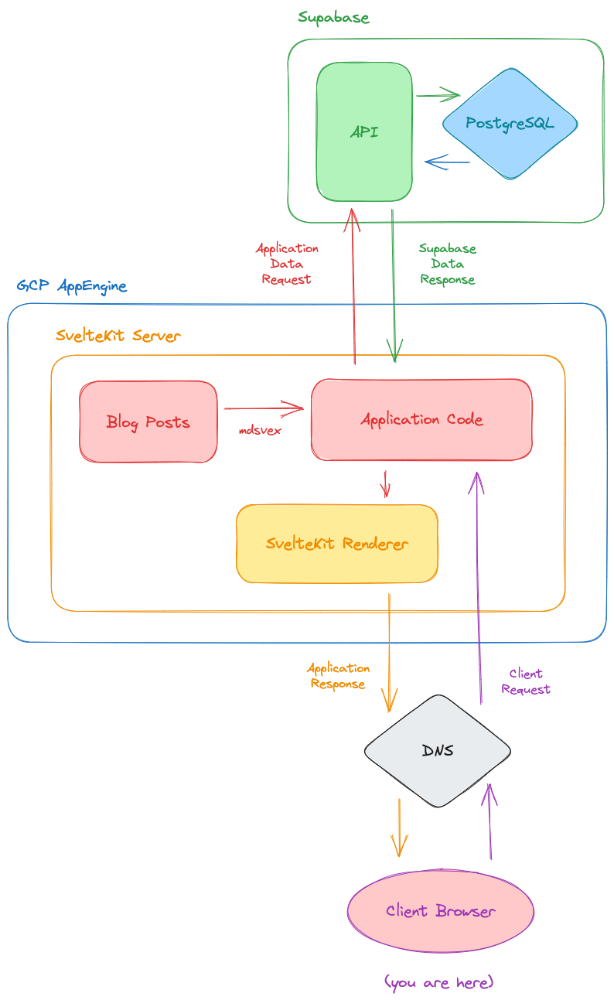

This site is powered by [SvelteKit](https://kit.svelte.dev/), a _meta-framework_ for making full stack web apps. It's a little overkill for this site, but I took a liking to it when working on [Ridemapper](https://github.com/henrygrant/ridemapper-svelte) and figured i'd keep the train going when I updated my personal site.

The background of the site is a map of where I've either run or ridden my bike around New York City. It's contructed requesting my activity polyline data from Ridemapper's backend and drawing it on an [OpenLayers](https://openlayers.org/) map. This data is stored in a [PostgreSQL](https://www.postgresql.org/) database wrapped by a [Supabase](https://supabase.com/) instance I use for a number of projects.

The blog posts are written in [Markdown](https://en.wikipedia.org/wiki/Markdown) and processed with [mdsvex](https://github.com/pngwn/mdsvex). The icons used on the site are from [FontAwesome](https://fontawesome.com/).

[GCP AppEngine](https://cloud.google.com/appengine) is used to host/serve the the SvelteKit app, and I use [Github Actions](https://github.com/features/actions) to deploy the site when I update it.

